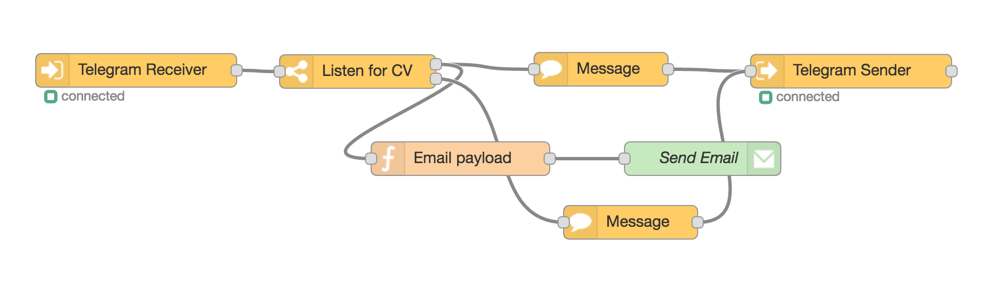
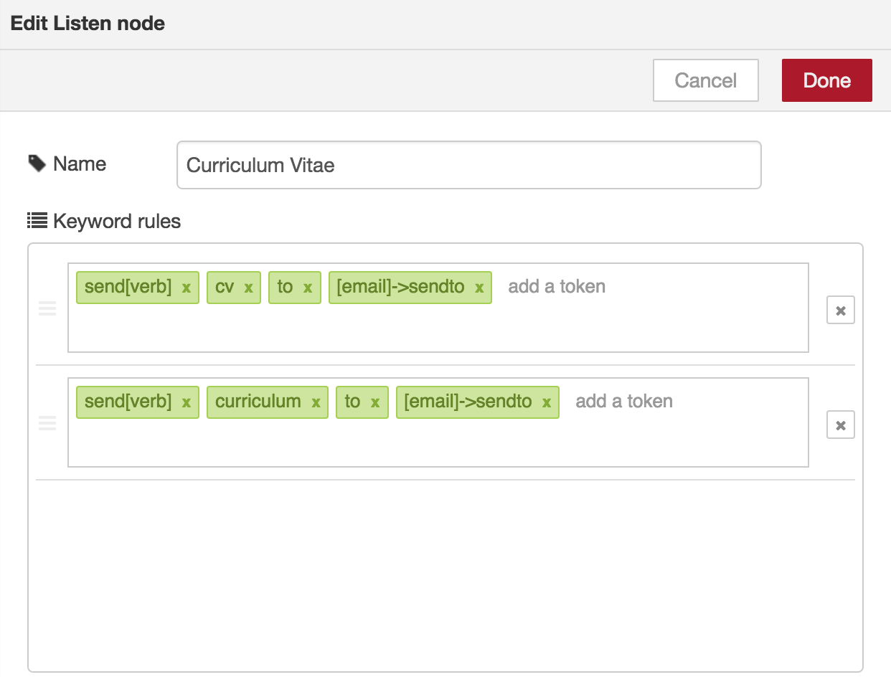
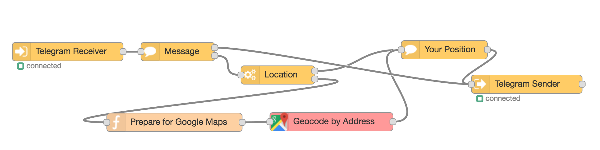
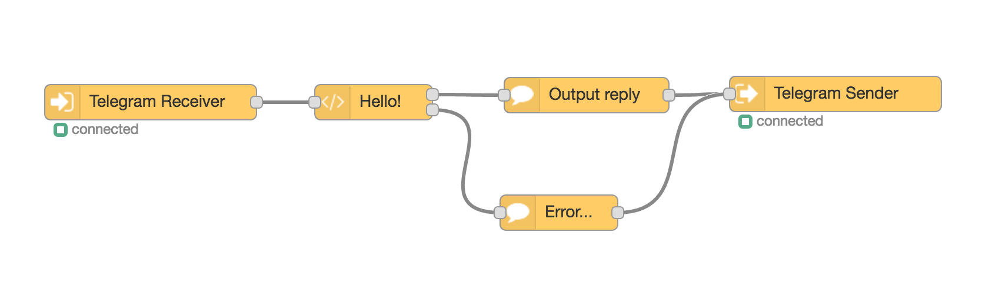

With **RedBot** you can visually build a full featured chat bot for **Telegram**, **Facebook Messenger** and **Slack** with Node-RED. ~~Almost~~ no coding skills required.

> Node-RED is a tool for wiring together hardware devices, APIs and online services in new and interesting ways.

## Getting started

First of all install  [Node-RED](http://nodered.org/docs/getting-started/installation)

```
sudo npm install -g node-red
```

Then open  the user data directory `$HOME/.node-red` and install the package

```
cd $HOME/.node-red
npm install node-red-contrib-chatbot
```

Then run

```
node-red
```

The next step is to create a chat bot, I reccomend to use **Telegram** since the setup it's easier ( **Telegram** allows polling to receive messages, so it's not necessary to create a https certificate).
Use **@BotFather** to create a chat bot, [follow instructions here](https://core.telegram.org/bots#botfather) then copy you access **token**.

Then open your **Node-RED** and add a `Telegram Receiver`, in the configuration panel, add a new bot and paste the **token**


Now add a `Message` node and connect to the  `Telegram Receiver`


Finally add a `Telegram Sender` node, don't forget to select in the configuration panel the same bot of the `Telegram Receiver`, this should be the final layout


Now you have a useful bot that answers *"Hi there!"* to any received message. We can do a lot better.

## Available nodes
* **Message**: sends a text message from the chat bot, supports templating (variable like `{{firstName}}`, etc), tracking of response and quoting a previous comment  [All]
* **Waiting**: sets the waiting status on the chat client (something like _your_chatbot is typing_ ) [All]
* **Command**: listen to a command type message (for example `/command1`, `/my-command`, etc) [All]
* **Image**: takes the `msg.payload` binary (or a local file) and sends out as image to the chat, can track response [All]
* **Audio**: takes the `msg.payload` binary (or a local file) and sends out as audio to the chat, can track response [Telegram, Facebook]
* **Request**: request special information from the chat client like the current location or the phone numbers [Telegram].
* **Buttons**: request information to the chat user using buttons using a predefined list [Telegram, Facebook]
* **Parse**: Parse the incoming message searching for some type of data (string, number, date, location, contact, etc) [All]
* **Log**: Convert a chat message (inbound or outbound) to a single line string suitable to be sent to a log file [All]
* **Location**: Send a location type message that will be shown with a map by the chat client [All]
* **Listen**: Listen for a set of tokens, it's a very simple way to match sentences [All]
* **Debug**: Debug incoming messages and chat contexts (useful to get the `chatId` ) [All]
* **RiveScript**: use [RiveScript.com](https://www.rivescript.com/) to elaborate answers [All]
* **QRCode**: create a QR code image [All]
* **Language**: detect message language [All]

## Examples
Here are some examples connecting the ChatBot blocks

### Basic Send Message

The first node `/hi` listen the incoming messages for the string *"/hi"*, if it finds it pass through the outpin otherwise nothing.

The second node `Hi!` simply outputs a message using the templating `Hi {{username}}!`, the message node just prepares the payload for the message, the node `Telegram Sender` actually sends out the message.

The node `Telegram Receiver` sets up some variables in the chat context flow: *firstName*, *lastName*, *chatId* , *username*, *transport*, *messageId*.
*Note*: username is only available in Telegram if it's specified in the chat settings.

### Collect Email

This is an example of how to parse the user input. The first **Email** block after the receiver just show a prompt message, note that the sender block tracks the user answer, that means that next message from the user will start from here and will be re-routed to the output to the `Telegram Sender` node.

If a valid email is found then the parsed value will be routed to the first output otherwise the second. The parsed email is available as payload or can be stored in the flow context,  for example in the `email` variable.

The **Show Email** is just a simple message block that uses templating to show variables store in flow context (or global): `Your email is {{email}}`
### Authorized Users

In the node `Telegram Receiver` it's possible to specify a comma seprated list of authorized users (either the userId or the username), for every inbound message the `authorized` boolean variable will be updated in the chat context.

The node `Authorized?` sends the message through the first output is the user is authorized, otherwise the second output.
### Send Image

This example respons to a command `/cam` in the chat sending an image.
The first node `/cam` triggers an http request (for example to the URL of a web cam), then resulting payload is sent to the `Image` node which prepares the payload for the `Telegram Sender` node.
The **/cam** command also triggers a waiting message *"Uploading a photo..."* while the image is downloaded.
### Log Chats

The Log node takes a message payload (inbound or outbound) and trasforms it in a string suitable to be appended to a log file.

```
196520947 [Guidone72] > Thu Jun 30 2016 18:46:31 GMT+0200 - /help
196520947 [Guidone72] < Thu Jun 30 2016 18:46:31 GMT+0200 - Hi this the outbound message as answer
```

### Parse Sentences
The `Listen Node` is able to detect and parse a set of simple sentence. For example suppose we would like to offer the the chatbot user the option to request our curriculum vitae and deliver that by email



The first block listen to incoming message and verify that it matches a set of tokens, if it matches the message is routed to the first output, otherwise the second output.
The `Listen Node` is configured in this way



basically there are a set of tokens that must be present in the message in order to match. It' sufficient that one set of tokens matches to have the message routed to the first output.
The `Listen Node` also takes into account small changes to the word (using  Levenshtein distance algorithm), for example, in that case

```
"send your cv to an_email@gmail.com" // ok
"send your curriculum to an_email@gmail.com" // ok
"send your curricula to an_email@gmail.com" // ok
"send your curriculum" // no, missing email
"send to an_email@gmail.com" // no, missing cv or curriculum token
```

There are some special tokes like `{{email}}` that matches any token that looks like and email and store it the chat context (in that case the key will be "email").

A little bit of coding is required to prepare the payload for the email node

```
// get the chat context
var chatId = msg.originalMessage.chat.id
var chat = context.flow.get('chat:' + chatId);
// email payload
msg.to = chat.get('email');
msg.payload = 'Hi, this is my curriculum vitae';
msg.attachments = [
  {
   filename: 'my_cv.pdf',
   path: '/my_cv.pdf'
}];
return msg;
```

The first output of the `Listen Node` is also connected to a confirmation message to be sent back to the user: `Sending resume to {{email}}`. Here the variable `{{email}}` is automatically replaced by the value present in the chat context.

### Tracking answers
Complex chatbots may require to request some information to the user and then go on with the rest of the flow, in this example


The user receive a message `"Please enter your email:"`, note that the `Telegram Sender` node has an output, that means that the next message from the same user will be automatically re-routed to the rest of the flow connected to that output, continuing in this way the conversation. The `Parse Node` scan the message for the email and store it the chat context, the final message just show the captured value `"Your email is {{email}}"`.

After 5 minutes if inactivity from the user, the conversation is considered ended and the next messages will be routed the the root of the flow.
In order to enable the output pin `Telegram Sender` check the *track* option in the configuration panel.

### Send a Location
Here is an example where the chatbot request the user location. The user can share his location with the *"share"* button in Telegram and Facebook or can insert manually the address, here is the flow



First is presented a message to the user asking to share his position, this is connected to a `Telegram Sender`  with the *tracking* option activated, the answer to this message will not start over the flow but will continue to the nodes attached to this sender output.

The answer of the user is then captured by the `Parse node`, which parse the incoming message searching for a location-type message (an object containing latitude and longitude) and it's the result of the user sharing the position with the chat client ( *Telegram* or *Facebook* ). If it doesn't match the message is routed to the second output, (this happens when the user writes his location manually) to the **Google Geolocation** node.

The final message just the coordinates `"Your position is {{location.latitude}}, {{location.longitude}}"`

### Using RiveScript
[RiveScript](https://www.rivescript.com/) is a simple scripting language for chatbots with an easy to learn syntax.



The most simple script
```
! version = 2.0

+ hello bot
- Hello, human!
```
If the user input matches *"Hello bot"* it returns on the first output the string *"Hello, human!"*.
If the `RiveScript node` doesn't match anything, it sends the error message to the second output.
Read the [RiveScript tutorial](https://www.rivescript.com/docs/tutorial) for all language details.

`RiveScript node` is able to read user input and store it in the chat context
```
! version = 2.0

+ my name is guido
- <set name=<star>>ok, I'll remember your name as <get name>
```

## Variable Contexts
**Node Red** has two variable context *global* and *flow*, the first is available everywhere in the app, the second just in the executed flow.

 **Node-red-contrib-chatbot** adds the *chat* context where is possible to store information related to the specific user. The Receiver stores here some information like *chatId*, *username*, *authorized*, etc.

To get the chat context in a function node:

```
var chatId = msg.originalMessage.chat.id
var chat = context.flow.get('chat:' + chatId);
console.log(chat.get('authorized')); // is the user authorized
console.log(chat.get('username')); // guidone72
chat.set('my_stuff', 'remember that');
```

## Template Variables
In the template system some defaults variables are available using the *{{variable}}* syntax

* **chatId** - The chat id (same for a specific user)
* **messageId** - The message id
* **userId** - The user id
* **firstName** - First name, when available (for example in Telegram must me specified in preferences)
* **lastName** - Last name, when available (for example in Telegram must me specified in preferences)
* **authorized** - boolean, whether the user is authorized or not
* **transport** - the current transport, could be *telegram*, *facebook*, *slack*
* **message** - the current message from the user in string format

## Changelog
* **0.5.13** - added language node
* **0.5.11** - cache Rivescript and enable follow up
* **0.5.10** - In conversation node it's possible to select the transport
* **0.5.9** - **[breaking changes]** chat context is now stored in global and available in sub flows, parse node now stores parsed data in chat context, fixed a side effect in Rivescript
* **0.5.7** - Sender nodes now can log to file
* **0.5.6** - Telegram polling interval
- **0.5.4** - Fixed exception on restarting flows. Added quad code node
* **0.5.3** - Added RiveScript node
* **0.5.2** - Added markdown and html formatting to Telegram message node
- **0.5.1** - **[breaking changes]**: moved the tracking option to the sender node, this will break previous flows where the tracking output was in the message node. If errors on saving the flow occurs after the upgrade, export the whole flow and import it again. Added debug node.

## Roadmap
* Slack Sender & Receiver

## Known Problems
- There's no way to exit a current conversation
* Slack Sender and Receiver are not complete yet

## Credits
* Inspired by the Karl-Heinz Wind work [node-red-contrib-telegram](https://github.com/windkh/node-red-contrib-telegrambot)
* [Telegram Bot API for NodeJS](https://github.com/yagop/node-telegram-bot-api)

## The MIT License
Permission is hereby granted, free of charge, to any person obtaining a copy
of this software and associated documentation files (the "Software"), to deal in the Software without restriction, including without limitation the rights to use, copy, modify, merge, publish, distribute, sublicense, and/or sell copies of the Software, and to permit persons to whom the Software is furnished to do so, subject to the following conditions:

The above copyright notice and this permission notice shall be included in
all copies or substantial portions of the Software.

THE SOFTWARE IS PROVIDED "AS IS", WITHOUT WARRANTY OF ANY KIND, EXPRESS OR IMPLIED, INCLUDING BUT NOT LIMITED TO THE WARRANTIES OF MERCHANTABILITY, FITNESS FOR A PARTICULAR PURPOSE AND NONINFRINGEMENT. IN NO EVENT SHALL THE
AUTHORS OR COPYRIGHT HOLDERS BE LIABLE FOR ANY CLAIM, DAMAGES OR OTHER LIABILITY, WHETHER IN AN ACTION OF CONTRACT, TORT OR OTHERWISE, ARISING FROM, OUT OF OR IN CONNECTION WITH THE SOFTWARE OR THE USE OR OTHER DEALINGS IN THE SOFTWARE.
